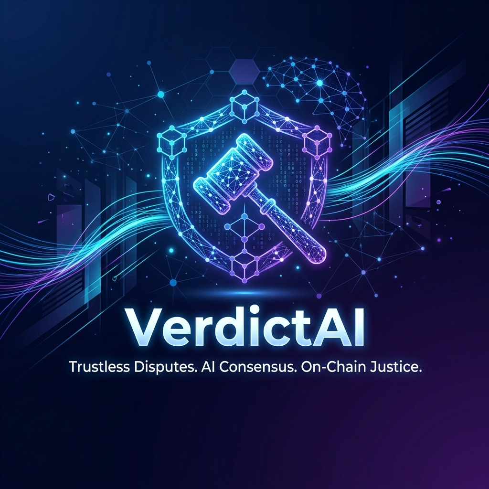
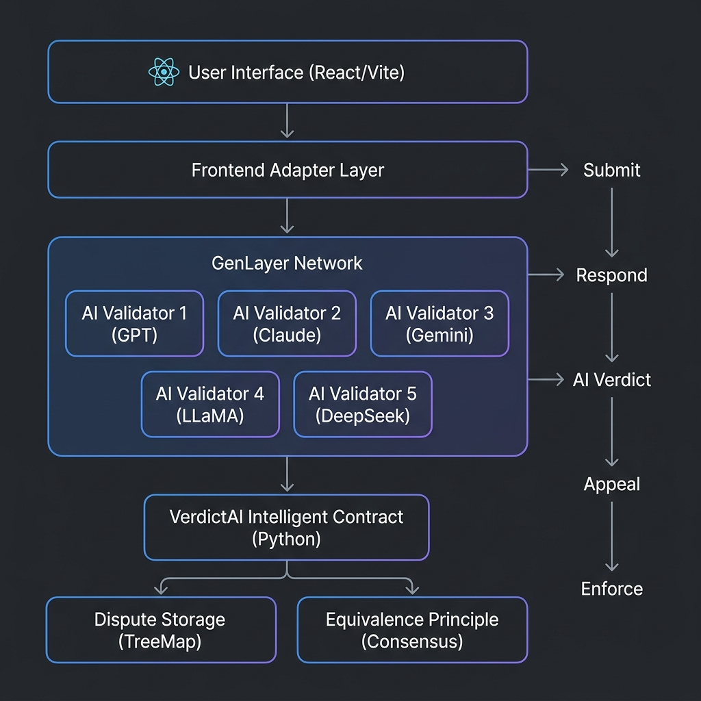
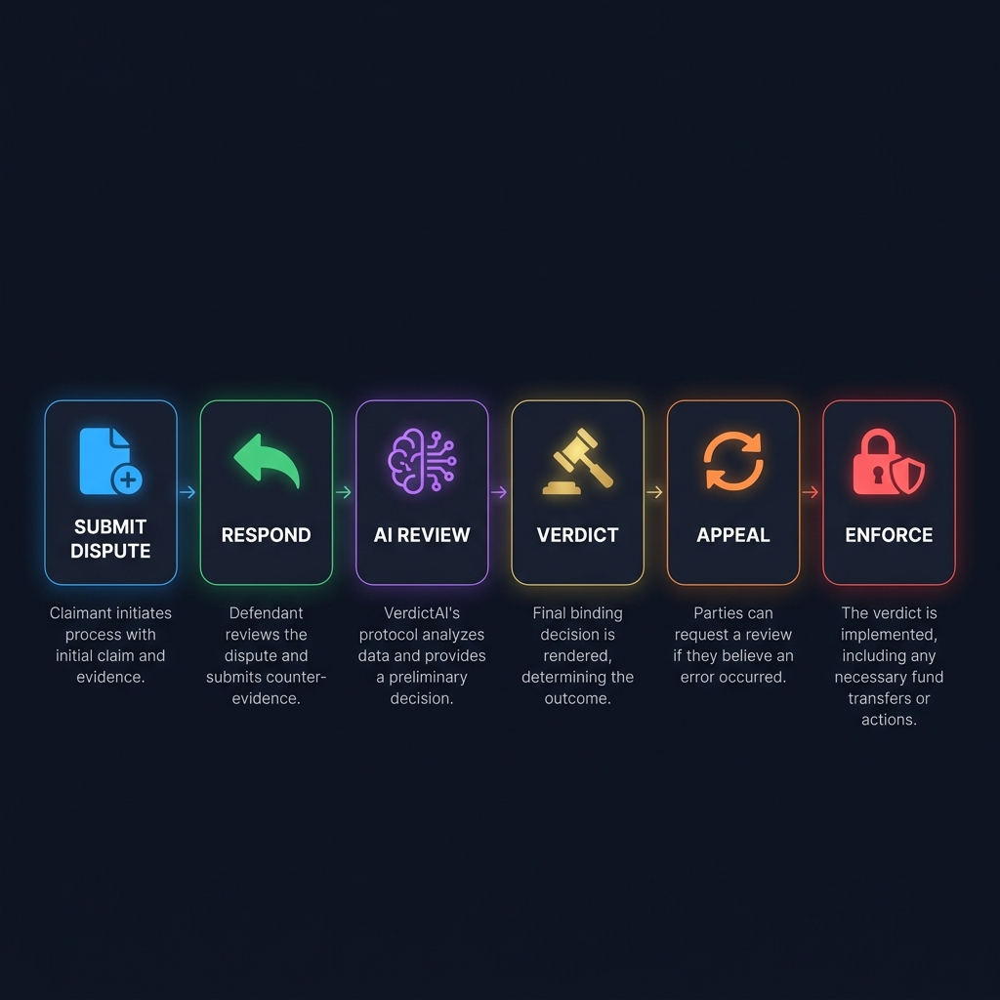
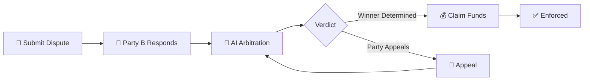

<p align="center">
  
</p>

<h1 align="center">⚖️ VerdictAI</h1>

<p align="center">
  <strong>Trustless Disputes. AI Consensus. On-Chain Justice.</strong>
</p>

<p align="center">
  <a href="#-features"></a>
  <a href="#-tech-stack"></a>
  <a href="#-smart-contract"></a>
  <a href="https://studio.genlayer.com"></a>
</p>

---

## 📖 Overview

**VerdictAI** is a decentralized dispute resolution protocol built on [GenLayer](https://genlayer.com). It replaces traditional arbitration with **AI-powered consensus** — where multiple Large Language Models (LLMs) act as impartial validators to analyze claims, evaluate evidence, and deliver binding verdicts on-chain.

Unlike traditional dispute resolution that requires expensive legal intermediaries and weeks of waiting, VerdictAI delivers **automated, fair, and transparent verdicts in minutes** through GenLayer's Optimistic Democracy consensus mechanism.

### 🎯 The Problem

| Traditional Arbitration | VerdictAI |
|------------------------|-----------|
| ⏳ Weeks to months | ⚡ Minutes |
| 💰 $5,000–$50,000+ costs | 💸 <1% protocol fee |
| 🏢 Centralized mediators | 🤖 AI-powered consensus |
| 📝 Paper-based process | ⛓️ Fully on-chain |
| 🔒 Opaque decisions | 🔍 Transparent reasoning |

---

## 🏗️ Architecture

<p align="center">
  
</p>

### System Architecture Diagram

```
┌─────────────────────────────────────────────────────────────┐
│                    Frontend (React/Vite/TS)                  │
│  ┌──────────┐ ┌──────────┐ ┌──────────┐ ┌───────────────┐  │
│  │   Hero   │ │Dashboard │ │  Detail  │ │Submit Dispute │  │
│  └──────────┘ └──────────┘ └──────────┘ └───────────────┘  │
│                           │                                  │
│  ┌──────────────────────────────────────────────────────┐   │
│  │           VerdictAI Adapter Layer                     │   │
│  │   Demo Mode │ Wallet-Signed │ GenLayer Contract      │   │
│  └──────────────────────────────────────────────────────┘   │
└─────────────────────────────────────────────────────────────┘
                            │
                    ┌───────▼───────┐
                    │  GenLayer SDK │
                    │ (genlayer-js) │
                    └───────┬───────┘
                            │
┌───────────────────────────▼─────────────────────────────────┐
│              GenLayer Bradbury Testnet                        │
│                                                              │
│  ┌────────────────────────────────────────────────────────┐  │
│  │         VerdictAI Intelligent Contract (Python)         │  │
│  │                                                        │  │
│  │  ┌──────────┐ ┌───────────┐ ┌──────────┐ ┌────────┐  │  │
│  │  │ Submit   │→│ Respond   │→│AI Verdict│→│Enforce │  │  │
│  │  │ Dispute  │ │ (Party B) │ │(Consensus│ │(Claim) │  │  │
│  │  └──────────┘ └───────────┘ └──────────┘ └────────┘  │  │
│  │                      │                                 │  │
│  │              ┌───────▼───────┐                        │  │
│  │              │ AI Arbitration│                        │  │
│  │              │    Engine     │                        │  │
│  │              └───────┬───────┘                        │  │
│  └──────────────────────┼────────────────────────────────┘  │
│                         │                                    │
│  ┌──────────────────────▼────────────────────────────────┐  │
│  │          Equivalence Principle (strict_eq)              │  │
│  │                                                        │  │
│  │  ┌────────┐ ┌────────┐ ┌────────┐ ┌────────┐ ┌─────┐ │  │
│  │  │ GPT-4  │ │ Claude │ │ Gemini │ │ LLaMA  │ │Deep │ │  │
│  │  │        │ │        │ │        │ │        │ │Seek │ │  │
│  │  └────────┘ └────────┘ └────────┘ └────────┘ └─────┘ │  │
│  │       ✓          ✓          ✓          ✓         ✓    │  │
│  │                  CONSENSUS REACHED                     │  │
│  └────────────────────────────────────────────────────────┘  │
└──────────────────────────────────────────────────────────────┘
```

---

## 🔄 Dispute Lifecycle

<p align="center">
  
</p>



| Phase | Status | Description |
|-------|--------|-------------|
| **Submit** | `responding` | Party A files dispute with escrow stake |
| **Respond** | `reviewing` | Party B submits counter-evidence and matching stake |
| **AI Review** | `reviewing` | AI validators analyze both claims |
| **Verdict** | `verdict` | Consensus reached, winner determined |
| **Appeal** | `appealed` | Loser may appeal once for re-evaluation |
| **Enforce** | `enforced` | Winner withdraws escrowed funds |

---

## ✨ Features

### 🤖 AI-Powered Arbitration
- **Multi-LLM Consensus**: 5 independent AI validators (GPT-4, Claude, Gemini, LLaMA, DeepSeek) analyze each dispute
- **Equivalence Principle**: All validators must agree on the outcome through GenLayer's `strict_eq` consensus
- **Structured Evaluation**: Claims assessed on Clarity (25%), Evidence (35%), Precedent (20%), Proportionality (20%)

### ⛓️ On-Chain Justice
- **Escrow Management**: Automatic stake locking upon dispute submission
- **Transparent Verdicts**: All reasoning and decisions stored immutably on-chain
- **Automated Enforcement**: Winners can claim funds directly through the contract

### 🔒 Fair & Trustless
- **No Central Authority**: No human mediator needed — pure AI consensus
- **One-Time Appeal**: Built-in appeal mechanism for losing parties
- **Deterministic Outcomes**: Same evidence always produces consistent verdicts

### 🎨 Premium UI/UX
- Beautiful dark-mode interface with glassmorphism effects
- Real-time dispute tracking dashboard
- Live integration status panel
- Responsive design for all devices

---

## 🛠️ Tech Stack

| Layer | Technology | Purpose |
|-------|-----------|---------|
| **Frontend** | React 19 + TypeScript | User interface |
| **Styling** | TailwindCSS 4 | Design system |
| **Build** | Vite 7 | Development & bundling |
| **Blockchain** | GenLayer Bradbury Testnet | Intelligent contract execution |
| **Contract** | Python (GenLayer SDK) | Dispute logic & AI arbitration |
| **Client SDK** | genlayer-js | Frontend ↔ contract communication |
| **AI Validators** | GPT-4, Claude, Gemini, LLaMA, DeepSeek | Multi-LLM consensus |
| **Storage** | TreeMap (on-chain) | Dispute state management |
| **IPFS** | Pinata (optional) | Evidence file storage |
| **Wallet** | MetaMask / Demo Mode | User authentication |

---

## 📁 Project Structure

```
VerdictAI/
├── contracts/
│   └── verdict_ai.py          # 🧠 GenLayer Intelligent Contract
│                               #    - AI arbitration engine
│                               #    - Dispute lifecycle management
│                               #    - Equivalence Principle consensus
│
├── sdk/
│   ├── index.ts               # 📦 Official TypeScript SDK
│   ├── package.json           #    - @verdictai/sdk npm package
│   └── tsconfig.json          #    - Ready for npm publish
│
├── docs/
│   ├── B2B_API.md             # 🔗 B2B Integration Guide
│   └── images/                # 🖼️ Documentation assets
│
├── src/
│   ├── App.tsx                 # Main application component
│   ├── main.tsx                # Entry point
│   ├── index.css               # Global styles
│   │
│   ├── components/
│   │   ├── Dashboard.tsx       # Dispute list & statistics
│   │   ├── DisputeDetail.tsx   # Full dispute view with timeline
│   │   ├── SubmitDispute.tsx   # New dispute form
│   │   ├── Hero.tsx            # Landing page hero section
│   │   ├── Features.tsx        # Feature showcase
│   │   ├── HowItWorks.tsx      # Process explanation
│   │   ├── LiveDemo.tsx        # Interactive demo section
│   │   ├── Header.tsx          # Navigation & wallet connect
│   │   ├── Footer.tsx          # Site footer
│   │   └── IntegrationStatus.tsx # Live dependency checker
│   │
│   ├── services/
│   │   ├── verdictaiAdapter.ts # Contract interaction adapter
│   │   ├── genlayerClient.ts   # GenLayer SDK client
│   │   ├── appConfig.ts        # Environment configuration
│   │   ├── verdictSource.ts    # Verdict resolution logic
│   │   ├── readiness.ts        # Integration readiness checks
│   │   └── ipfs.ts             # IPFS upload service
│   │
│   ├── types/
│   │   └── dispute.ts          # TypeScript type definitions
│   │
│   ├── utils/
│   │   ├── fees.ts             # Fee calculation utilities
│   │   ├── wallet.ts           # Wallet connection helpers
│   │   └── formatting.ts       # Display formatting
│   │
│   └── data/
│       └── mockDisputes.ts     # Demo dispute data
│
├── .env.example                # Environment template
├── .env.local                  # Local configuration (gitignored)
├── package.json                # Dependencies & scripts
├── tsconfig.json               # TypeScript config
├── vite.config.ts              # Vite build config
├── ROADMAP.md                  # Development roadmap
├── INTEGRATION_SETUP.md        # Integration guide
└── VerdictAI_PRD.md            # Product Requirements Document
```

---

## 📜 Smart Contract

### Deployed Contract

| Property | Value |
|----------|-------|
| **Network** | GenLayer Bradbury Testnet |
| **Address** | `0x82dF22192e2a54805bEa3737EAF29F3A717AfC95` |
| **Language** | Python (GenLayer SDK) |
| **Studio** | [studio.genlayer.com](https://studio.genlayer.com) |

### Contract Methods

#### Write Methods

| Method | Parameters | Description |
|--------|-----------|-------------|
| `submit_dispute` | category, title, description, claimant_name, claim, evidence_hash, respondent_address, respondent_name, stake_amount | Party A opens a dispute |
| `respond_to_dispute` | dispute_id, claim, evidence_hash, respondent_name, stake_amount | Party B responds |
| `request_ai_verdict` | dispute_id | Triggers AI validator consensus |
| `withdraw_funds` | dispute_id | Winner claims escrowed funds |
| `appeal_verdict` | dispute_id | One-time appeal by losing party |

#### Read Methods

| Method | Parameters | Returns |
|--------|-----------|---------|
| `get_dispute_status` | dispute_id | Full dispute JSON with parties, status, verdict |
| `get_dispute_count` | — | Total number of disputes filed |
| `get_verdict` | dispute_id | Verdict JSON (winner, confidence, reasoning) |

### AI Arbitration Engine

The core of VerdictAI is the AI Arbitration Engine inside the Intelligent Contract:

```python
def _run_ai_arbitration(self, dispute: Dispute) -> str:
    def get_winner() -> str:
        prompt = (
            "You are an impartial AI arbitrator.\n"
            "Decide who wins this dispute.\n\n"
            "PARTY A - " + dispute.party_a.name + ": " + dispute.party_a.claim + "\n"
            "PARTY B - " + dispute.party_b.name + ": " + dispute.party_b.claim + "\n\n"
            "Who has the stronger case? Respond with ONLY one word: A or B or split"
        )
        return gl.nondet.exec_prompt(prompt)

    # All 5 validators must agree on the winner
    winner = gl.eq_principle.strict_eq(get_winner)
    return winner
```

**How it works:**
1. Each of the 5 AI validators independently evaluates the dispute
2. The `gl.eq_principle.strict_eq` ensures all validators agree on the same winner
3. If consensus is reached, the verdict is stored on-chain
4. If not, leader rotation occurs until consensus or timeout

---

## 🚀 Getting Started

### Prerequisites

- **Node.js** ≥ 18
- **npm** or **yarn**
- **MetaMask** browser extension (optional, for wallet mode)

### Installation

```bash
# Clone the repository
git clone https://github.com/pamerato16-bot/VerdictAI.git
cd VerdictAI

# Install dependencies
npm install

# Copy environment template
cp .env.example .env.local

# Start development server
npm run dev
```

### Environment Configuration

Edit `.env.local`:

```env
# GenLayer network
VITE_GENLAYER_CHAIN=studionet
VITE_GENLAYER_ENDPOINT=https://studio.genlayer.com/api
VITE_GENLAYER_CONTRACT_ADDRESS=0x82dF22192e2a54805bEa3737EAF29F3A717AfC95

# Optional: IPFS for evidence uploads
VITE_PINATA_JWT=your_pinata_jwt_token
```

### Deploy Contract (GenLayer Studio)

1. Go to [studio.genlayer.com](https://studio.genlayer.com)
2. Click **New Contract** → paste `contracts/verdict_ai.py`
3. Click **Deploy new Instance**
4. Copy the deployed contract address to `.env.local`

---

## 🧪 Testing the Full Flow

### In GenLayer Studio

```
Step 1: Deploy contract
Step 2: submit_dispute(category, title, description, ...)
Step 3: respond_to_dispute(dispute_id, claim, evidence_hash, ...)
Step 4: request_ai_verdict(dispute_id)  ← AI consensus happens here
Step 5: get_verdict(dispute_id)  ← View the AI decision
Step 6: appeal_verdict(dispute_id)  ← Optional appeal
Step 7: withdraw_funds(dispute_id)  ← Claim funds
```

### Verified Test Results ✅

| Step | Transaction | Result |
|------|-------------|--------|
| Deploy | ✅ FINALIZED | Contract deployed successfully |
| submit_dispute | ✅ FINALIZED | Dispute DSP-1 created |
| respond_to_dispute | ✅ FINALIZED | Counter-evidence submitted |
| request_ai_verdict | ✅ FINALIZED | AI consensus reached |
| appeal_verdict | ✅ FINALIZED | Appeal processed |
| request_ai_verdict (appeal) | ✅ FINALIZED | Re-evaluation complete |
| withdraw_funds | ✅ FINALIZED | Funds released |

---

## 💡 Use Cases

| Category | Example |
|----------|---------|
| **Freelance** | Client refuses payment after completed milestones |
| **DAO** | Treasury allocation disputes between members |
| **NFT** | Authenticity or ownership disagreements |
| **DeFi** | Protocol parameter change disputes |
| **General** | Any contract disagreement needing fair resolution |

---

## 🗺️ Roadmap

**Last updated:** `March 31, 2026`

| Phase | Status | Description |
|-------|--------|-------------|
| Phase 1 - Foundation | ✅ Complete | App state, data model, UI cleanup |
| Phase 2 - Live Flow | ✅ Complete | Real dispute submission & dashboard |
| Phase 3 - Respondent | ✅ Complete | Party B response flow |
| Phase 4 - Wallet/Contract | ✅ Complete | Wallet connect + GenLayer adapter |
| Phase 5 - Evidence/Verdict | ✅ Complete | IPFS + AI verdict engine |
| Phase 6 - Enforcement | ✅ Complete | Appeal + withdraw funds |
| Phase 7 - Demo Ready | ✅ Complete | Smart contract deployed & tested |
| Phase 8 - Production | ✅ Complete | SDK, B2B API, mainnet-ready config |

---

## 🏆 Hackathon

**Competition:** GenLayer Bradbury Hackathon  
**Deadline:** April 4, 2026  
**Track:** Intelligent Contract Applications  

### Key Differentiators

1. **First AI-powered dispute resolution** on GenLayer
2. **Multi-LLM consensus** — not just one AI, but 5 independent validators
3. **Full lifecycle** — from submission to enforcement, all on-chain
4. **Production-ready architecture** — clean adapter pattern, extensible design
5. **Real working demo** — not mockups, actual AI verdicts on testnet

---

## 📄 License

MIT License — see [LICENSE](LICENSE) for details.

---

## 📦 SDK

The official `@verdictai/sdk` package provides a clean API for any dApp to integrate dispute resolution:

```typescript
import { createVerdictAI } from '@verdictai/sdk';

const vai = createVerdictAI({
  contractAddress: '0x82dF22192e2a54805bEa3737EAF29F3A717AfC95',
  chain: 'testnetBradbury',
});

// Submit a dispute
await vai.submitDispute(walletAddress, {
  category: 'freelance',
  title: 'Payment Dispute',
  description: 'Work completed but payment withheld',
  claimantName: 'Alice',
  claim: 'I delivered all milestones',
  evidenceHash: 'QmIPFS...',
  respondentAddress: '0xBob...',
  respondentName: 'Bob',
  stakeAmount: 1000000n,
});

// Check verdict
const verdict = await vai.getVerdict('DSP-1');
console.log(verdict?.winner); // 'A', 'B', or 'split'
```

📖 Full API reference: [docs/B2B_API.md](docs/B2B_API.md)

---

## 🤝 Contributing

Contributions welcome! Please read the [INTEGRATION_SETUP.md](INTEGRATION_SETUP.md) for technical details.

---

<p align="center">
  <strong>Built with ❤️ for the GenLayer Bradbury Hackathon 2026</strong>
  <br/>
  <sub>Powered by GenLayer's Optimistic Democracy + Equivalence Principle</sub>
</p>
